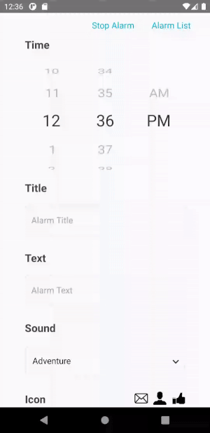
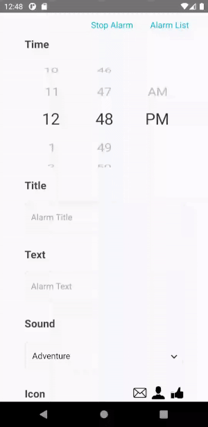
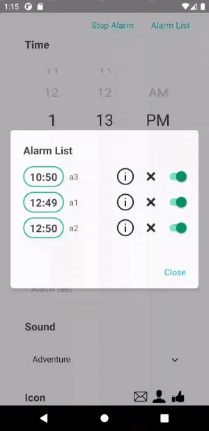
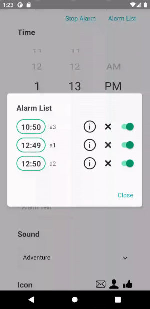
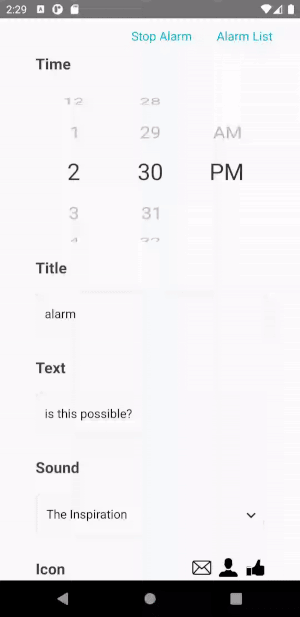

# react-native-alarm-manager

[](https://www.npmjs.org/package/react-native-alarm-manager)
[](https://packagephobia.com/result?p=react-native-alarm-manager)


Alarm manager for React Native

## Table of Contents

  - [Installation](#installation)
    - [Adding the package](#adding-the-package)
      - [npm](#npm)
      - [yarn](#yarn)
    - [Manipulating codes in your project](#manipulating-codes-in-your-project)
      - [Check android SDK](#check-android-sdk)
      - [Register components](#register-components)
      - [Overriding MainActivity methods](#overriding-mainactivity-methods)
      - [Create resource directory](#create-resource-directory)
  - [Usage](#usage)
    - [Props](#props)
    - [Alarm Scheduling](#alarm-scheduling)
    - [Alarm Searching](#alarm-searching)
      - [One](#one)
      - [All](#all)
    - [Alarm Modifying](#alarm-modifying)
    - [Alarm Deleting](#alarm-deleting)
    - [Alarm Stopping](#alarm-stopping)
  - [Example](#example)
    - [Alarm scheduling from the main page](#alarm-scheduling-from-the-main-page)
    - [Alarm searching from the top toolbar](#alarm-searching-from-the-top-toolbar)
    - [Alarm modifying from the alarm list](#alarm-modifying-from-the-alarm-list)
    - [Alarm deleting from the alarm list](#alarm-deleting-from-the-alarm-list)
    - [Alarm toggling from the alarm list](#alarm-toggling-from-the-alarm-list)
    - [Alarm stopping after activation](#alarm-stopping-after-activation)
  - [License](#license)


## Installation

### Adding the package

#### npm

```bash
$ npm install react-native-alarm-manager
```

#### yarn

```bash
$ yarn add react-native-alarm-manager
```

### Manipulating codes in your project

#### Check android SDK

This package is compiled with Android SDK Platform 29.  
Your project SDK version doesn't matter.  
Android SDK Platform 29 must be installed.

#### Register components

Go to AndroidManifest.xml and register the service and receiver.

```xml
<manifest ... >
    <application ... >
      <activity ... >
      </activity>
      
      <!-- Add the following code -->
      <service android:name="com.baekgol.reactnativealarmmanager.util.AlarmService" android:enabled="true" android:exported="false" />
      <receiver android:name="com.baekgol.reactnativealarmmanager.util.AlarmReceiver" android:enabled="true" android:exported="false" />
      <receiver android:name="com.baekgol.reactnativealarmmanager.util.BootReceiver" android:enabled="false" android:exported="false" >
          <intent-filter android:priority="999">
              <action android:name="android.intent.action.BOOT_COMPLETED" />
          </intent-filter>
      </receiver>
      
    </application>
</manifest>
```

#### Overriding MainActivity methods

Go to MainActivity.java and override the onCreate and createReactActivityDelegate methods as follows.  
It can work properly during the process of calling parameters and rebooting the android with alarm functions.

```java
@Override
protected void onCreate(Bundle savedInstanceState) {
  super.onCreate(savedInstanceState);

  ComponentName receiver = new ComponentName(this, BootReceiver.class);
  PackageManager packageManager = this.getPackageManager();

  packageManager.setComponentEnabledSetting(receiver,
          PackageManager.COMPONENT_ENABLED_STATE_ENABLED,
          PackageManager.DONT_KILL_APP);
}

@Override
protected ReactActivityDelegate createReactActivityDelegate() {
  return new ReactActivityDelegate(this, getMainComponentName()){
    @Nullable
    @Override
    protected Bundle getLaunchOptions() {
      Intent intent = getIntent();
      Bundle bundle = intent.getExtras();

      if(intent.getBooleanExtra("notiRemovable", true))
        AlarmModule.stop(this.getContext());

      return bundle;
    }
  };
}
```

#### Create resource directory

Configure your project's resource directory.  
This is a necessary process to apply the alarm sound and notification icon.

```
project/app/src/main/res/raw       // alarm sound
project/app/src/main/res/drawable  // notification icon
```

## Usage

First, import the module to use the alarm function.

```javascript
import Alarm from 'react-native-alarm-manager';
```

### Props

|Prop|Type|Description|Note|
|-|-|-|-|
|**alarm_id**|Number|Unique value of an alarm.|Auto Increment|
|**alarm_time**|String|Value to set the alarm time.|HH:mm:00|
|**alarm_title**|String|Title of notification.|Nullable|
|**alarm_text**|String|Text of notification.|Nullable|
|**alarm_sound**|String|Sound that rings when the alarm is activated.|Exclude file extensions|
|**alarm_icon**|String|Icon of notification.|Exclude file extensions|
|**alarm_sound_loop**|Boolean|Value to set whether the alarm sounds repeatedly.|Default: true|
|**alarm_vibration**|Boolean|Value to set whether the alarm will vibrate when it is activated.|Default: true|
|**alarm_noti_removable**|Boolean|Value to set whether to end the alarm when an notification is clicked.|Default: true|
|**alarm_activate**|Boolean|Value to set whether to activate the alarm.|Default: true|

### Alarm Scheduling

This schedules an alarm.
Make sure that alarm_time must be in HH:mm:00 format.
* Hour(00 ~ 23)
* Minute(00 ~ 59)
* Second(00)

```javascript
const alarm = {
  alarm_time: 12:30:00,   // HH:mm:00
  alarm_title: 'title',
  alarm_text: 'text',
  alarm_sound: 'sound',   // sound.mp3
  alarm_icon: 'icon',     // icon.png
  alarm_sound_loop: true,
  alarm_vibration: true,
  alarm_noti_removable: true,
  alarm_activate: true
};

Alarm.schedule(
  alarm,
  success => console.log(success),  // success message
  fail => console.log(fail)         // fail message
);
```

### Alarm Searching

Alarm searching is provided in two ways.

#### One

This searches for an alarm.  
You can access the alarm_id to obtain alarm information for that ID.

```javascript
Alarm.search(
  id,
  success => console.log(success),  // alarm
  fail => console.log(fail)         // fail message
);
```

#### All

This searches for all alarms.

```javascript
Alarm.searchAll(
  success => console.log(success),  // alarm list
  fail => console.log(fail)         // fail message
);
```

### Alarm Modifying

This is almost identical to alarm scheduling, but must be additionally given alarm_id.    
Alarm information for that ID will be changed.  
If you want an alarm toggle, just change the alarm_activate.

```javascript
const alarm = {
  alarm_id: 3,
  alarm_time: 15:27:00,   // HH:mm:00
  alarm_title: 'title modify',
  alarm_text: 'text modify',
  alarm_sound: 'sound3',  // sound.mp3
  alarm_icon: 'icon2',    // icon.png
  alarm_sound_loop: false,
  alarm_vibration: true,
  alarm_noti_removable: false,
  alarm_activate: true    // value for alarm toggle
};

Alarm.modify(
  alarm,
  success => console.log(success),  // success message
  fail => console.log(fail)         // fail message
);
```

### Alarm Deleting

This deletes the alarm for that ID.  
This also automatically cancels the alarm schedule.

```javascript
Alarm.delete(
  id,
  success => console.log(success),  // success message
  fail => console.log(fail)         // fail message
);
```

### Alarm Stopping

This turns off the alarm.  
This means that the sound stops and the notification disappears.

```javascript
Alarm.stop(
  success => console.log(success),  // success message
  fail => console.log(fail)         // fail message
);
```

## Typescript 
Typescript declaration types has been added in version 1.2.0, it provides a set of convenient types that can be used while writing a typescript RN app.

```typescript
import Alarm, {AlarmScheduleType} from 'react-native-alarm-manager';

const alarm: AlarmScheduleType = {
  alarm_time: '15:27:00', // HH:mm:00
  alarm_title: 'title',
  alarm_text: 'text',
  alarm_sound: 'sound', // sound.mp3
  alarm_icon: 'icon', // icon.png
  alarm_sound_loop: false,
  alarm_vibration: true,
  alarm_noti_removable: false,
  alarm_activate: true, // value for alarm toggle
};

Alarm.schedule(
  alarm,
  success => console.log(success),
  fail => console.log(fail),
);
```
```typescript
import Alarm, {AlarmType} from 'react-native-alarm-manager';

const alarm: AlarmType = {
  alarm_id: 3,
  alarm_time: '15:27:00', // HH:mm:ss
  alarm_title: 'title modify',
  alarm_text: 'text modify',
  alarm_sound: 'sound3', // sound3.mp3
  alarm_icon: 'icon2', // icon2.png
  alarm_sound_loop: false,
  alarm_vibration: true,
  alarm_noti_removable: false,
  alarm_activate: true, // value for alarm toggle
};

Alarm.modify(
  alarm,
  success => console.log(success),
  fail => console.log(fail),
);
```
## Example

### Alarm scheduling from the main page



### Alarm searching from the top toolbar



### Alarm modifying from the alarm list



### Alarm deleting from the alarm list



### Alarm toggling from the alarm list


### Alarm stopping after activation



## License

[MIT](LICENSE)
